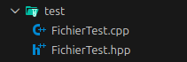
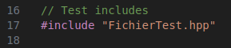
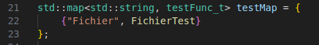
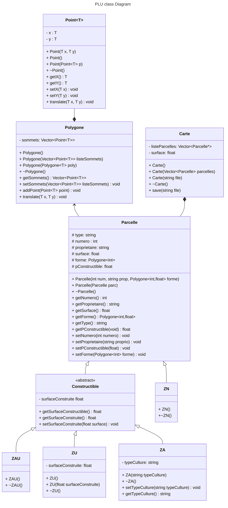

# CPP - TP4 Noté

- Eugénie
- Annabelle
- Jack
- Nathan


## Build

Create build dir
```bash
mkdir build
```

Compile
```bash
cmake -Bbuild
cmake --build build/
```

Run default
```bash
./build/CPP_TP4
```

## Tests

Run Tests
```bash
./build/CPP_TP4_Test nomClasse

ex:
./build/CPP_TP4_Test Point Polygon Fichier
```

## Codes de test

Les codes de test doivent être mis dans le dossier `test/`



### Ajout fonction de test

Le `mainTest()` utilise un `map<>` pour lier le nom des classes au fonctions de test.

Il faut donc faire les modification suivantes :

> Ajout du `.hpp` des fichiers de test.  
>   

> Ajout du de la fonction de test dans le `map<>`.  
> 

## Architecture
Cette section défini l'architecture du projet PLU.


### Diagramme de classe



### Détail de l'architecture
Nous avons choisis de ne pas faire hériter **ZA** de **ZN** car ils n'ont rien en commun à l'origine, hormis être des **Parcelles**. **ZA** est constructible mais pas **ZN** et **ZA** dispose d'une propriété supplémentaire que **ZN**.  
Nous avons également toutes nos classes qui sont **template** car à l'origine dans le sujet il était demandé d'instancier uniquement nos classes template en **int** mais cela nous faisais perdre l'intérêt du type template. Grâce à cela nous pouvons utiliser les autres types numériques (float, double, ...). Les types autres que les types standards numériques ne sont pas supportés.


### Détail des classes
**Classe Point**
- 
La classe Point permet de définir un *Point* dans un plan en 2D et dispose de getter et setter pour ses positions X et Y.
Elle contient une méthode `translate` permettant de déplacer une point. Le type de X ou Y est générique, permettant d'implémenter des entiers ou des flottants.

**Classe Polygone**
- 
La classe Polygone permet de définir une forme grâce à son attribut `sommets` étant un vecteur de Point. La classe à également ses setter et getter et contient deux méthodes:
- `translate`: permet de déplacer un polygone dans le plan 2D, c'est à dire déplaces les points définissant le polygone.
- `addPoint`: permet d'ajouter un point au polygone, c'est à dire à la liste de vecteur `sommets`.

**Classe Parcelle**
-
La classe Parcelle permet de définir une parcelle du PLU. Elle contient un `numero`, un `type`, un `proprietaire`, une `surface`,  un pourcentage constructible (`pConstructible`) et sa `forme` étant un Polygone.  
Parcelle dispose de setter et getter pour chacune de ses propriétés.
Elle à également une méthode virtuel pure `setType` permettant aux enfants héritants de pouvoir définir leur propre type (ZA, ZU, ZAU, ZN).

pConstructible est un float de 0 à 1 pour cacluler plus facilement les surfaces constructibles.

**Classe Carte**
-
La classe Carte défini le PLU, permettant de voir les différentes parcelles. Elle contient une `surface` et une liste de parcelles `listeParcelles` de type Parcelle.  
La carte peut être instancié à partir d'un fichier texte mais également d'être exporté en fichier texte grâce aux méthodes `load` et `save`.

**Classe Constructible**
-
La classe Constructible est une classe, permettant de définir une interface pour les parcelles constructible. Cette classe hérite de `Parcelle`. Elle a, en plus des propriétés de `Parcelle`, une propriété `surfaceConstructible`.

**Classe ZN**
-
La classe ZN défini les **Zones Naturelles et Forestières**. Cette classe hérite directement de `Parcelle` et ne redéfini aucune autre propriété ou méthode. N'héritant pas de `Constructible`, cette classe (type de parcelle) n'est pas constructible.

**Classe ZA**
-
La classe ZA défini les **Zones Agricoles**. Cette classe hérite directement de `Constructible` ce qui signifie qu'elle est constructible. Cette classe a comme propriété supplémentaire `typeCulture` permettant de définir le type de culture de la **ZA**.  
Une **ZA** peut être construite mais à une particularité, la surface constructible ne peut pas être supérieur à **10%** de sa surface.

**Classe ZAU**
-
La classe ZAU défini les **Zones à Urbaniser**. Cette classe hérite directement de `Constructible` signifiant que cette classe est constructible. 

**Classe ZU**
-
La classe ZU défini les **Zones Urbaines**. Cette classe hérite directement de `Constructible` ce qui signifie qu'elle est constructible comme une **ZAU**. Elle possède également une propriété supplémentaire, `surfaceConstruite` permettant de connaitre la surface déjà construite au sein de la **ZAU**. Elle a également le setter et getter associé.

**Classe Fichier**
-
La classe Fichier est une classe utilitaire permettant de lire et écrire des fichiers.  
Elle est conçue pour lire les fichiers de parcelle.  
En plus de la lecture et de l'écriture, la classe permet de créer les objets **Zx** à partir du texte.